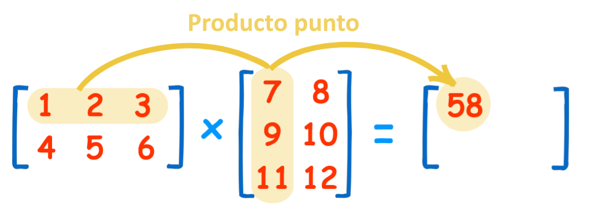
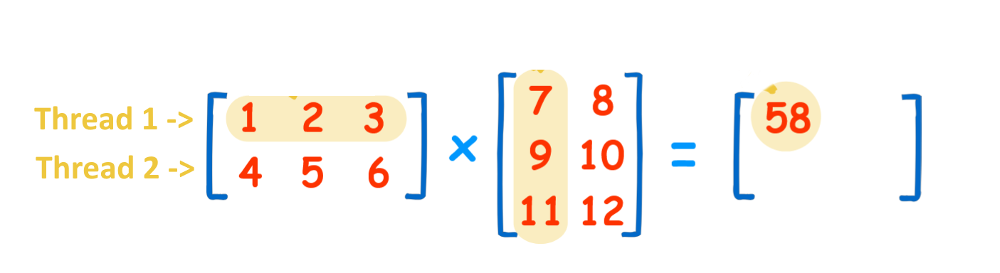
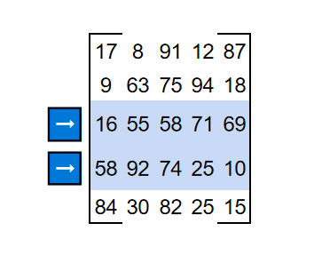

# Multiplicacion de matrices con threads

## Correr programa
```bash
python3 matmul.py matA.csv matB.csv 4 maltmul.out
```

## Explicación proyecto
### Producto punto
Una matriz es un arreglo de numeros, para hacer el producto punto de una matriz con otra matriz se multiplica la fila n de una matriz contra la columna n de la otra matriz, celda por celda.
Despues se suman todos los resultados, como se ve en la ilustración.


Este proceso manual de ir fila por fila toma bastante tiempo pero es posible paralelizarlo con *MultiThreading*.



### En código

1. Multiplicacion de matrices
```py
def matmul(matA, matB, start, end):
  global matC
  n = matA.shape[0]
  for i in range(start, end):
    for j in range(n):
      for k in range(n):
        matC[i][j] += int(matA[i][k] * matB[k][j])
        print("matmul, i = {}, j = {}, matC[i][j] = {}".format(i, j, matC[i][j]))
```
Esta función va a realizar el producto punto de una selección de filas de la primer matriz, esto nos va a permitir separarlas para después poderlas paralelizar.



2. Multiplicacion multihilos
```py
def parallelMatmul(matA, matB, matC, poolSize):
  threadHandle = []
  n = matA.shape[0]

  for j in range(0, poolSize):
    thread = Thread(target = matmul, args=(matA, matB, int((n/poolSize) * j), int((n/poolSize) * (j+1))))
    threadHandle.append(thread)
    thread.start()   
  
  for j in range(0, poolSize):
    threadHandle[j].join()
```


## Referencias
- https://matrix.reshish.com/multCalculation.php
- https://ahmedhanibrahim.wordpress.com/2016/04/29/python-3-ways-of-multi-threaded-matrix-multiplication/amp/
- https://github.com/khalidgt95/Python-MultiThreading